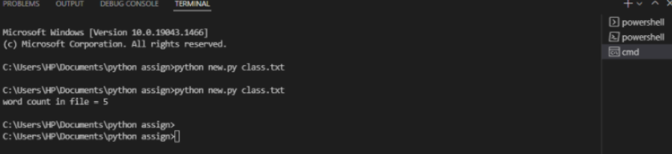

# command-line-arguments-to-count-word
## AIM:
To write a python program for getting the word count from the contents of a file using command line arguments.
## EQUIPEMENT'S REQUIRED: 
PC
Anaconda - Python 3.7
## ALGORITHM: 
## Step 1:  
     import sys
## Step 2: 
      Open line
## Step 3: 
      Using for loop
## Step 4: 
        Using split()
## Step 5: 
       Counting words using len()
## Step 6: 
        Print output()
## PROGRAM:
~~~
import sys

fp = open(sys.argv[1]) as fp

A = fp.read()

count=0
V=A.split()
for i in V:
    count+=1 
print("count",V)

print("count",count)
~~~

### OUTPUT:

## RESULT:
Thus the program is written to find the word count from the contents of a file using command line arguments.
